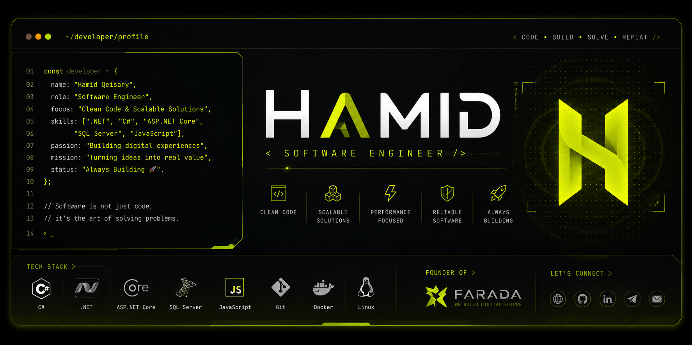

<!-- ===================================================== -->
<!--                       BANNER                           -->
<!-- ===================================================== -->

<p align="center">
  
</p>

<p align="center">
  <a href="./README.md">
    
  </a>
  &nbsp;
  <a href="./README.fa.md">
    
  </a>
</p>

---

# Hi, I'm Hamid 👋

### Software Engineer • .NET Developer • Founder of Farada

I build modern software solutions across **Web**, **Desktop**, **Mobile**, and **Backend** platforms using the Microsoft .NET ecosystem.

Passionate about creating scalable architectures, clean code, and user-focused digital experiences.

---

## About Me

```csharp
public class HamidQeisary
{
    public string Name => "Hamid Qeisary";

    public string Role => "Software Engineer";

    public string Company => "Farada";

    public string Focus =>
        "Building modern software with .NET technologies.";

    public string[] Building =>
    [
        "Web Applications",
        "Desktop Applications",
        "Mobile Applications",
        "REST APIs",
        "Business Software"
    ];

    public string[] Interests =>
    [
        "Software Architecture",
        "Clean Code",
        "Performance",
        "UI/UX",
        "Open Source"
    ];
}
```

---

<div align="center">

> **Turning ideas into reliable software.**

</div>

---

<!-- ===================================================== -->
<!--                  TECHNOLOGY STACK                     -->
<!-- ===================================================== -->

# Technology Stack

<table>
<tr>

<td valign="top" width="25%">

### 💻 Languages

- C#
- JavaScript
- TypeScript
- SQL

</td>

<td valign="top" width="25%">

### ⚙ Backend

- .NET
- ASP.NET Core
- ASP.NET MVC
- Minimal API
- RESTful API
- SignalR
- JWT Authentication
- Identity

</td>

<td valign="top" width="25%">

### 🗄 Database

- SQL Server
- MySQL
- Entity Framework Core
- LINQ

</td>

<td valign="top" width="25%">

### 🎨 Frontend

- React
- Next.js
- HTML5
- CSS3
- Tailwind CSS

</td>

</tr>
</table>

<table>
<tr>

<td valign="top" width="33%">

### 🛠 Development

- Visual Studio
- Visual Studio Code
- Git
- GitHub
- Docker
- Postman

</td>

<td valign="top" width="33%">

### 🧩 Architecture

- Clean Architecture
- SOLID Principles
- Design Patterns
- Dependency Injection
- Repository Pattern
- Unit of Work

</td>

<td valign="top" width="33%">

### ☁ Environment

- Windows
- Linux
- IIS
- Kestrel
- Docker
- Nginx

</td>

</tr>
</table>

---

## What I Build

- 🌐 Modern Web Applications
- 🖥 Desktop Software
- 📱 Mobile Applications
- ⚙ RESTful APIs
- 🏢 Enterprise Solutions
- 📊 Admin Dashboards
- 🔄 Business Automation Systems
- ☁ Scalable Backend Services

---

<!-- ===================================================== -->
<!--               CONNECT WITH ME                         -->
<!-- ===================================================== -->

# Connect With Me

<p align="center">

<a href="https://hwmid.ir">

</a>

<a href="mailto:hamidrezaqeisary@gmail.com">

</a>

<a href="https://github.com/HamidrezaQeisary">

</a>

</p>

<p align="center">

<a href="https://t.me/hwmidaam">

</a>

</p>

---

# Currently

- 🚀 Building **Farada**
- 💻 Developing modern software with **.NET**
- 🌱 Learning Cloud & DevOps technologies
- 📦 Preparing open-source projects
- 🎯 Focused on scalable software architecture

---

# Let's Build Something Great

If you have an idea, a project, or an opportunity to collaborate, I'd be happy to connect.

---

<p align="center">

### Thanks for visiting my profile ❤️

**Hamid Qeisary**  
Software Engineer • Founder of Farada

</p>

<!-- ===================================================== -->
<!--                 GITHUB ANALYTICS                      -->
<!-- ===================================================== -->

# GitHub Analytics

<p align="center">


</p>

<p align="center">


</p>

---

## Featured Repositories

<p align="center">

<a href="https://github.com/HamidrezaQeisary">

</a>

<a href="https://github.com/HamidrezaQeisary">

</a>

</p>

---

<p align="center">


</p>

---

<div align="center">

### Thanks for stopping by 👋

If you enjoy my work, consider ⭐ starring a repository or following my journey.

</div>
